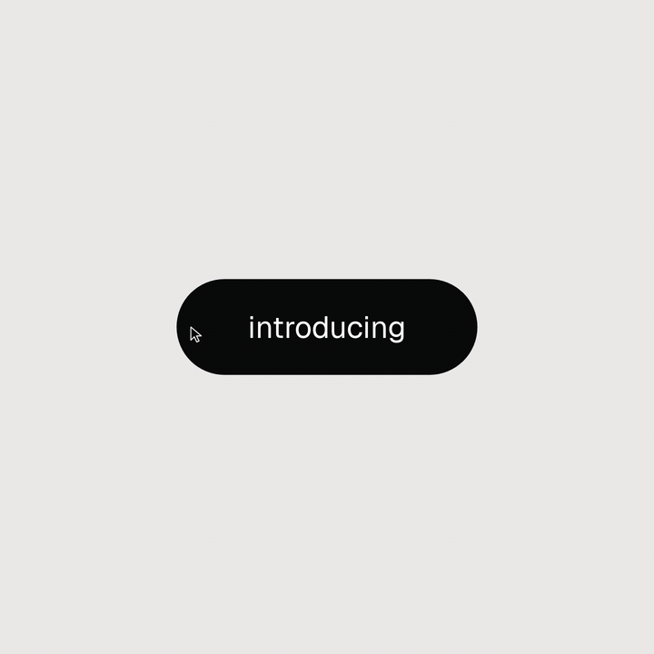

# motion-kit

<p align="center"></p>

<p align="center"><sub>The launch video, made with motion-kit itself (silent here). Music in the full video: "Tease Me" prod. by LoopGod (<a href="https://www.instagram.com/loopgodmusic/">@loopgodmusic</a>), used under licence.</sub></p>

Three [Claude Code](https://claude.com/claude-code) skills that turn any project's UI into
beat-synced motion videos and springy in-app motion, all in code. No After Effects,
Remotion or Lottie: every video frame is a pure function of time, so the same page renders
the same loop every time and re-times to any song.

The look and build rules adapt the open prompt template by
zero ([@twoclipping](https://x.com/twoclipping)): one shape that never cuts,
a cursor that drives every change, springs everywhere, and a last frame identical to the first.

Docs with the demo videos: <https://triippiing.github.io/Wiki/claude/motion-kit.html>

## The skills

| Skill | Use it for | Say something like |
|---|---|---|
| `motion-design` | Planning a promo or reel: questions, song measurement, a checked `MOTION-BRIEF.md` built from library components, then an approval stop before any code | "Make a promo video for my app to ~/Music/song.mp3" |
| `motion-video` | Building and rendering: song analysis, the `seek(t)` page, contact sheet, seam check, MP4, and ready-to-post exports | "Render it" / "Export it for Reels and X" |
| `motion-ui` | Live product UI: indicators, toggles, drags, interruptible transitions, following the project's own motion rules | "Make this tab indicator springier" |

## Install (macOS)

Needs Homebrew, `ffmpeg` (`brew install ffmpeg`), Node 20.11+ and Python 3 with numpy.

```bash
git clone https://github.com/triippiing/motion-kit.git ~/motion-kit
~/motion-kit/install.sh   # links the skills, installs missing deps + the transitions.dev companion, runs the doctor
```

`install.sh` installs ffmpeg, numpy, Playwright with Chromium and WebKit when they are missing, then runs
`skills/motion-video/scripts/doctor.sh`, which prints the exact fix for anything still missing
(only Homebrew itself needs a manual, password-prompted install).

## Components

Videos are built from a library of 29 ready-made UI components (buttons, toggles, tabs, loaders,
toasts, charts, a dock, a command palette, and real app footage...) that each fill the one morphing shape. A row in the
video's state table names one and the cursor presses it:

```js
{ at: 6,  use: 'toggle', on: false, label: 'Notifications' },   // states()
{ at: 7,  target: 'knob', press: true },                        // cursor(): flips it
```

- [CATALOG.md](skills/motion-video/components/CATALOG.md): every component with a picture, props and an example
- [RECIPES.md](skills/motion-video/components/RECIPES.md): five complete sequences to start from
- [WRITING-A-COMPONENT.md](skills/motion-video/components/WRITING-A-COMPONENT.md): adding your own

## Companion: transitions.dev

`install.sh` also installs the free [transitions.dev](https://transitions.dev) Claude Code skills by
Jakub Antalik (a catalog of 32 ready-made UI transitions). `motion-ui` and `motion-design` suggest
matching transitions from it while you build. It is installed from its own source and never copied
into this repo, per its terms. Skip it with `./install.sh --no-transitions`.

## Using it with Claude

Open Claude Code in the cloned folder, or just give it this repo's URL: `CLAUDE.md` explains
the whole project (pipeline, page contract, rules, code map, tests). Once installed, the skills
trigger on their own in any project, e.g. "make a 15 second promo of this app to ~/Music/song.mp3".

## Using it by hand

```bash
S=~/.claude/skills/motion-video/scripts
$S/new_project.sh ~/promo ~/Music/song.mp3 --bars 7 --theme ./app/style.css   # measure the song, scaffold
node $S/sync.mjs ~/promo             # check the beat grid by ear, mark moments (see Syncing); Ctrl+C when done
# edit ~/promo/index.html: the states() and cursor() tables (start from a recipe)
node $S/check_brief.mjs ~/promo      # if you wrote a MOTION-BRIEF.md: check its tables
node $S/beat_stills.mjs ~/promo      # contact sheet + loop-seam check
node $S/render.mjs ~/promo           # -> ~/promo/out/video.mp4
node $S/export.mjs ~/promo --for reels,x,discord,web   # -> ~/promo/out/exports/ (see Exporting)
```

## Syncing

The kit measures a song's beat grid, but only your ear can confirm it. Open the sync page:

```bash
node ~/.claude/skills/motion-video/scripts/sync.mjs ~/promo
```

It plays the loop with a click on every beat next to the live animation. If the clicks drift, nudge
the grid with ↑ / ↓ (5 ms, Shift for 20 ms) or tap the tempo (T, then Enter). Set the meter
and swing if the song needs them. Scrub with ← / → (10 ms, Shift a quarter beat, Alt to the next beat line;
each step plays a short blip of the song) and press **M** to mark a moment (a drop, a vocal) and name it.
Click a flag and type in its **add a note** field (e.g. "the roll into the chorus"; notes never affect timing). Then
**Sounds right** and **Save** (Ctrl/Cmd+S). Save writes the `sync` section of `song.json` (keeping a
`song.json.bak`) and re-cuts the clip from your original song.

A row in the animation can then hit the moment by name, even between beats:

```js
{ at: 'drop', target: 'button', press: true },             // cursor(): the press, on the drop
{ at: 'drop', offset: 0.5, use: 'check', label: 'Done' },  // states(): its result, half a beat later
```

Keys, limits and errors: the Sync section of [the motion-video skill](skills/motion-video/SKILL.md).

## Exporting

One command turns a finished project into ready-to-post files, one per destination:

```bash
node ~/.claude/skills/motion-video/scripts/export.mjs ~/promo --for reels,x,discord,web
```

The files land in `~/promo/out/exports/` with a `manifest.json` describing each one. Each shape
(vertical for Reels/TikTok/Shorts, square or landscape for X/LinkedIn) is rendered natively, not
letterboxed. Every file stays under its platform's size cap (the presets and their sources are in
[presets.json](skills/motion-video/presets.json)), or the export stops with an error rather than ship an
over-limit file; a piece longer than a platform allows gets a warning. The presets are
`reels`, `tiktok`, `shorts`, `x`, `x-landscape`, `linkedin`, `linkedin-landscape`, `discord`,
`discord-nitro`, `web` and `gif`. Add `--silent` to drop the audio. The full guide is the Export section
of [the motion-video skill](skills/motion-video/SKILL.md).

## Pipeline

```
song ──analyze_song.py──▶ song.json (BPM, downbeat, beat grid, loop window, rules) + clip.wav
project CSS ──extract_theme.py──▶ theme.css / theme.json (canvas, surface, ink, muted, accent, font, pos?, neg?)
new_project.sh DIR SONG [--size square|vertical|landscape|WxH] [--theme app.css]
sync.mjs DIR ──▶ hear the grid by ear, nudge / tap tempo / mark moments ─▶ song.json sync + re-cut clip.wav
index.html: window.seek(t) computes every style from t (closed-form springs, shared/springs.js)
beat_stills.mjs DIR ──▶ one still per beat + contact sheet + loop-seam check
render.mjs DIR ──▶ Playwright frames ─▶ ffmpeg tmix motion blur + audio + UI sounds ─▶ out/video.mp4
export.mjs DIR --for reels,x,... ──▶ one render per shape ─▶ per-platform encodes ─▶ out/exports/ + manifest.json
```

## Layout

```
shared/springs.js        closed-form damped springs (spring, track, live, fromSettle), no deps
skills/motion-design/    planning skill + direction and state-plan references
skills/motion-video/     scripts, seek(t) template, component library, tests
skills/motion-ui/        in-app motion skill + tested patterns
demos/                   01 reference sequence, 02 finance-app promo, 03 dock pill capture
CLAUDE.md                the project guide for Claude (and people): start here
CREDITS.md               everyone and everything this builds on
```

## Tests

```bash
npm test   # node:test suites + python unittest
```

## Music

The demos were cut to a commercial track for local viewing; audio files are git-ignored and
never committed. Bring your own licensed song and re-run `analyze_song.py`: everything re-times.
Posting a piece cut to a commercial track? Export it with `--silent`, or the platform may mute it.

## Credits

Built on the work of zero (@twoclipping), Jakub Antalik (transitions.dev) and Jesse Vincent
(Superpowers), with demo music by Anderson .Paak featuring Kendrick Lamar. Full credits, including
fonts and tools: [CREDITS.md](CREDITS.md).

## License

MIT
