# Component catalog

<!-- GENERATED by scripts/build_catalog.mjs from each component's meta. Do not edit; run the script. -->

Name a component in a `states()` row with `use:` and pass its props as keys. Aim the cursor at a hotspot with `target:`.

```js
{ at: 4, use: 'toast', text: 'Exported' }            // states()
{ at: 3.5, target: 'toast', press: true }             // cursor()
```

## Row keys

Every row accepts these keys whatever its component (they are never component props):

| Key | What it does |
|---|---|
| `at` | the beat the row starts on, or a marker name from the sync page (required) |
| `offset` | beats added to a marker `at` (`{ at: 'drop', offset: 0.5 }`); only with a marker |
| `use` | the component, by the name of its heading below |
| `fill` | the shape's background: a theme role (`canvas`, `surface`, `ink`, `muted`, `accent`; `pos`, `neg` (when the theme defines them)) or `#rrggbb`; overrides the component's own |
| `ink` | the shape's text colour: a theme role or `#rrggbb`; overrides the component's own |
| `w`, `h`, `r` | the shape's width, height and corner radius in design px (1440 stage), numbers >= 0; override the component's size |
| `shake` | `true`: an error shake when the row arrives |
| `badge` | a number: a count bubble on the shape's top-right corner for the row; it stays on across consecutive badge rows, popping when the count changes; 0 shows none |
| `hide` | cursor rows: fades the cursor out from this beat; the next row without it fades it back in; cannot press |

## Controls

[button](#button) · [checkbox](#checkbox) · [dropdown](#dropdown) · [input](#input) · [slider](#slider) · [tabs](#tabs) · [toggle](#toggle)

### button

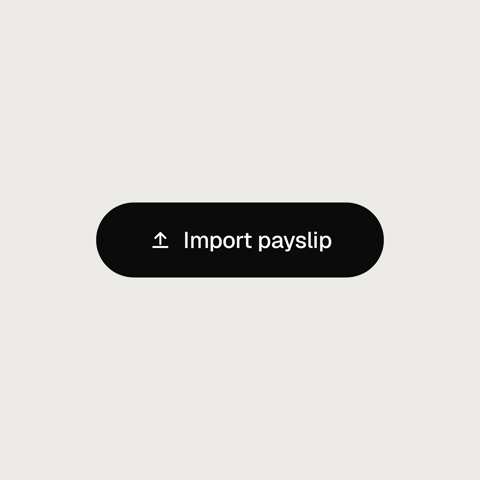

**Use when:** A call to action is pressed: start, import, buy, sign up.

**Motion:** Presses dip the label slightly with the cursor; the shape morphs in from the previous state.

| Prop | Type | Default |
|---|---|---|
| `label` | `string` | `"Get started"` |
| `icon` | `enum:none\|upload\|plus\|play\|check\|sparkle\|chevron` | `"none"` |

**Hotspots:** `button`  
**Sounds:** none

```js
{ at: 0, use: 'button', label: 'Import payslip', icon: 'upload' }
```

### checkbox

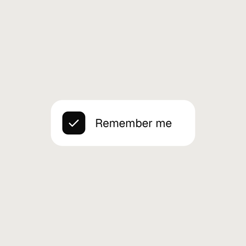

**Use when:** An option is ticked: remember me, agree to terms, a to-do done.

**Motion:** Checking fills the box with the accent and draws the tick on; a press on the box dips it and checks it at the press. A checked row draws its tick as it arrives. A following checkbox row continues from where the presses left it (write the pressed result as its `checked`); a continuation to unchecked empties the box.

| Prop | Type | Default |
|---|---|---|
| `checked` | `boolean` | `false` |
| `label` | `string` | `"Remember me"` |

**Hotspots:** `box`  
**Sounds:** none

```js
{ at: 0, use: 'checkbox', checked: true, label: 'Remember me' }
```

### dropdown

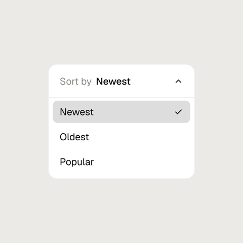

**Use when:** A menu opens and an option is chosen: sort order, a filter, an account.

**Motion:** Write the closed and open states as consecutive rows: the shape grows to open, the chevron turns, and the items stagger in. A press on an item highlights it and moves the check there, and a following dropdown row continues from that choice (write it as its `selected`). A closed row after an open one fades the items out as the shape closes and shows the choice in the trigger.

| Prop | Type | Default |
|---|---|---|
| `label` | `string` | `"Sort by"` |
| `items` | `string[]` | `["Newest","Oldest","Popular"]` |
| `open` | `boolean` | `false` |
| `selected` | `string` | `""` |

**Hotspots:** `trigger`, `item:<item>`  
**Sounds:** none

```js
{ at: 0, use: 'dropdown', label: 'Sort by', open: true, selected: 'Newest' }
```

### input

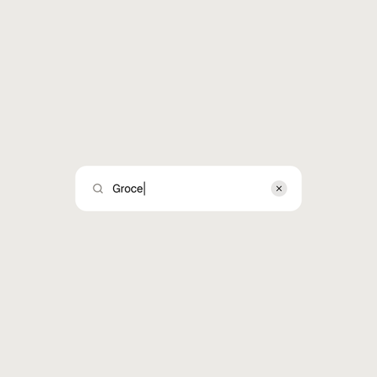

**Use when:** Something is typed: a search, an amount, a name.

**Motion:** Text types in one character every perChar beats from typeAt (beats after the row starts; -1 shows it at once), with a key sound each, a solid caret while typing and a blink about once a second after (trimmed so whole blinks fit the loop). The clear button appears with the first character; a press on it dissolves the text back to the placeholder. A following input row continues from what is left (cleared text is gone): text that extends it keeps typing on; other text changes dissolve the old text.

| Prop | Type | Default |
|---|---|---|
| `placeholder` | `string` | `"Search"` |
| `text` | `string` | `""` |
| `typeAt` | `number` | `-1` |
| `perChar` | `number` | `0.25` |
| `icon` | `enum:search\|none` | `"search"` |

**Hotspots:** `field`, `clear`  
**Sounds:** key

```js
{ at: 0, use: 'input', placeholder: 'Search transactions', text: 'Groceries', typeAt: 0.25, perChar: 0.2 }
```

### slider

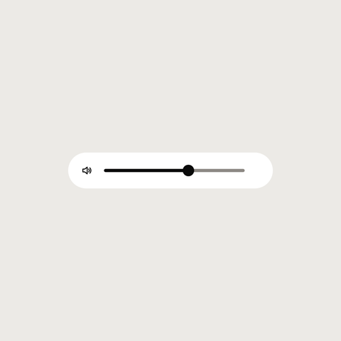

**Use when:** A value is dragged: volume, brightness, an amount.

**Motion:** Between a press 'down' on the thumb and the next 'up' the thumb follows the cursor. Dragged past an end (overstretch), the track stretches with a rubber band; on release the value springs back inside. A following slider row continues from the released value (write it as its `value`) and glides to its own value if that differs. The thumb hotspot aims at the row's written value. A `label` sits left of the track (the shape widens to fit it); a following slider row with a different label crossfades it.

| Prop | Type | Default |
|---|---|---|
| `value` | `number` | `0.4` |
| `min` | `number` | `0` |
| `max` | `number` | `1` |
| `overstretch` | `boolean` | `true` |
| `icon` | `enum:volume\|none` | `"volume"` |
| `label` | `string` | `""` |

**Hotspots:** `thumb`, `track`  
**Drag:** `thumb` (a drag is three cursor rows: down, move, up)  
**Sounds:** none

```js
{ at: 0, use: 'slider', value: 0.6 }
```

### tabs

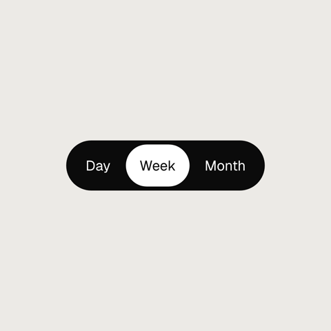

**Use when:** A view switches between a few peers: day/week/month, list/grid, plans.

**Motion:** A press on a tab sends the indicator there: the leading edge moves first, so it stretches and settles, and quick reversals stay inside the bar. The active label is shown in the indicator. A following tabs row continues from the last pressed tab (write it as its `active`) and travels on arrival if `active` differs.

| Prop | Type | Default |
|---|---|---|
| `items` | `string[]` | `["Day","Week","Month"]` |
| `active` | `string` | `"Day"` |

**Hotspots:** `tab:<item>`  
**Sounds:** none

```js
{ at: 0, use: 'tabs', items: ['Day', 'Week', 'Month'], active: 'Week' }
```

### toggle

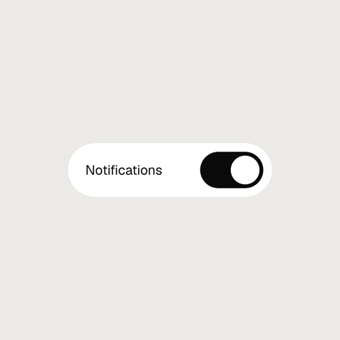

**Use when:** A setting switches on or off: notifications, dark mode, auto-save.

**Motion:** Each press on the knob flips it: the leading edge moves first, so the knob stretches across and settles; the track fades from muted to accent. A following toggle row continues from where the presses left it (write the pressed result as its `on`), and flips on arrival if its `on` differs. The knob hotspot aims at the row's written side.

| Prop | Type | Default |
|---|---|---|
| `on` | `boolean` | `false` |
| `label` | `string` | `""` |

**Hotspots:** `knob`  
**Sounds:** none

```js
{ at: 0, use: 'toggle', on: true, label: 'Notifications' }
```

## Feedback

[check](#check) · [loader](#loader) · [progress](#progress) · [status](#status) · [toast](#toast)

### check

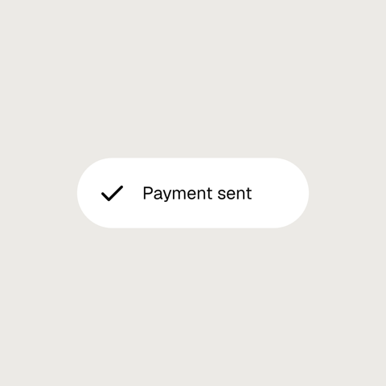

**Use when:** Something succeeded: paid, saved, sent, done.

**Motion:** The tick draws on over 0.8 beat from 0.15 beat after the row starts, then the label rises in beside it. The tick sits at the left end of the shape, so it stays put while the shape morphs to fit a label. A following check row keeps the tick drawn and crossfades a changed label.

| Prop | Type | Default |
|---|---|---|
| `label` | `string` | `""` |

**Hotspots:** none  
**Sounds:** none

```js
{ at: 0, use: 'check', label: 'Payment sent' }
```

### loader

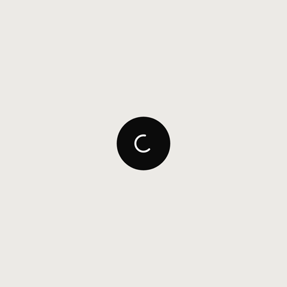

**Use when:** Something is working: uploading, syncing, thinking, between a press and its result.

**Motion:** The spinner turns steadily at about 450 degrees a second (one turn in about 0.8 s); the dots brighten in turn on a cycle of about 0.9 s. Periods are trimmed so a whole number of cycles fits the loop, and both run off the clock, so the motion carries on unbroken through a following loader row; a change of style there crossfades.

| Prop | Type | Default |
|---|---|---|
| `style` | `enum:spinner\|dots` | `"spinner"` |

**Hotspots:** none  
**Sounds:** none

```js
{ at: 0, use: 'loader' }
```

### progress

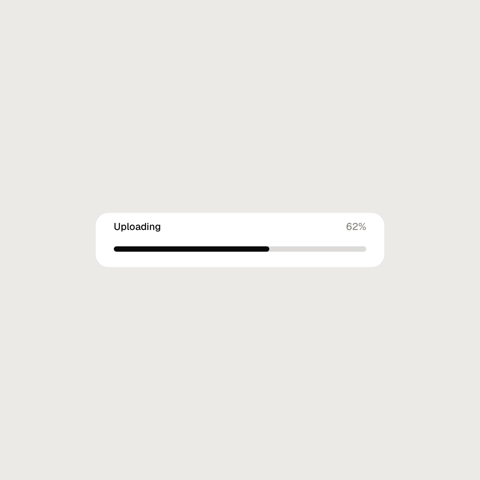

**Use when:** Something advances towards done: an upload, an import, a goal.

**Motion:** The fill grows from empty to the value over about a beat (no overshoot) and the percentage counts with it. A following progress row carries on from the previous value, so a chain of rows reads as one bar filling in steps; a changed label crossfades.

| Prop | Type | Default |
|---|---|---|
| `value` | `number` | `0.62` |
| `label` | `string` | `"Uploading"` |

**Hotspots:** none  
**Sounds:** none

```js
{ at: 0, use: 'progress', value: 0.62, label: 'Uploading' }
```

### status

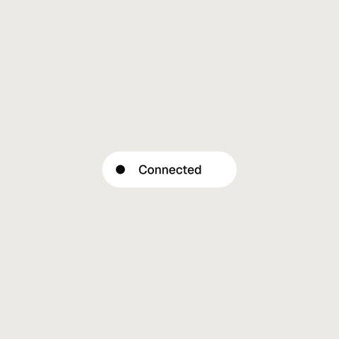

**Use when:** A live state is shown: connected, syncing, offline, a build passing or failing.

**Motion:** Warn and error dots pulse (1 to 1.25 and back about every 1.2 s, trimmed so whole pulses fit the loop); ok holds still. A following status row morphs: collapsing or expanding folds the text away or brings it in, a new level blends the dot colour and eases the pulse in or out, and new text crossfades.

| Prop | Type | Default |
|---|---|---|
| `level` | `enum:ok\|warn\|error` | `"ok"` |
| `text` | `string` | `"Connected"` |
| `collapsed` | `boolean` | `false` |

**Hotspots:** none  
**Sounds:** none

```js
{ at: 0, use: 'status', level: 'ok', text: 'Connected' }
```

### toast

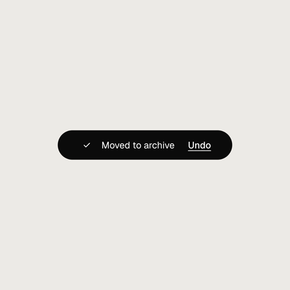

**Use when:** The app confirms something briefly: saved, copied, moved to archive (with Undo).

**Motion:** The content rises 12px and unblurs as it fades in after the shape arrives. A press on the action dips it. A following toast row crossfades changed content the same way.

| Prop | Type | Default |
|---|---|---|
| `text` | `string` | `"Saved"` |
| `icon` | `enum:check\|info\|none` | `"check"` |
| `action` | `string` | `""` |

**Hotspots:** `toast`, `action`  
**Sounds:** none

```js
{ at: 0, use: 'toast', text: 'Moved to archive', action: 'Undo' }
```

## Data and content

[bar-chart](#bar-chart) · [calendar](#calendar) · [card](#card) · [counter](#counter) · [goal](#goal) · [line-chart](#line-chart) · [list](#list) · [sparkline](#sparkline)

### bar-chart

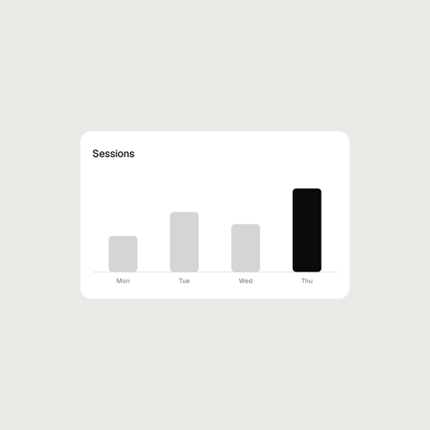

**Use when:** A few amounts side by side: sessions per day, spending per category.

**Motion:** Bars grow from the baseline 0.08 beat apart (no overshoot). With `highlight` set to a bar's label that bar is accent and the rest muted; a press on `bar:<label>` moves the highlight there, and a following bar-chart row continues from it (write it as its `highlight`). A following row also morphs: bars with the same label slide and grow to their new place and height, new bars grow in, missing ones shrink away.

| Prop | Type | Default |
|---|---|---|
| `bars` | `object[]` | `[{"label":"Mon","value":3},{"label":"Tue","value":5},{"label":"Wed","value":4},{"label":"Thu","value":7}]` |
| `label` | `string` | `"Sessions"` |
| `highlight` | `string` | `""` |

**Hotspots:** `bar:<label>`  
**Sounds:** none

```js
{ at: 0, use: 'bar-chart', label: 'Sessions', highlight: 'Thu' }
```

### calendar

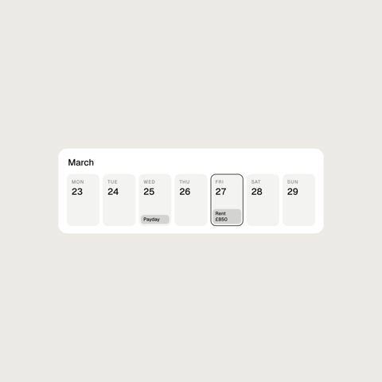

**Use when:** Something lands on a day: payday, a bill due, a booking.

**Motion:** The days rise in left to right, then the event chips. `week` is any ISO date (YYYY-MM-DD); the week shown is the Monday-to-Sunday week containing it, with real weekdays and dates. `selected` (1 = Monday ... 7 = Sunday) or a press on `day:<n>` gives that day an accent border; a following calendar row continues from the pressed day (write it as its `selected`). A following row in the same week keeps the days, fades changed chips out and in, and moves the selection; a different week crossfades the days.

| Prop | Type | Default |
|---|---|---|
| `week` | `string` | `"2026-03-23"` |
| `marks` | `object[]` | `[{"day":3,"label":"Payday"},{"day":5,"label":"Rent £850"}]` |
| `selected` | `number` | `-1` |
| `title` | `string` | `"March"` |

**Hotspots:** `day:<n>`  
**Sounds:** none

```js
{ at: 0, use: 'calendar', week: '2026-03-23', title: 'March', selected: 5 }
```

### card

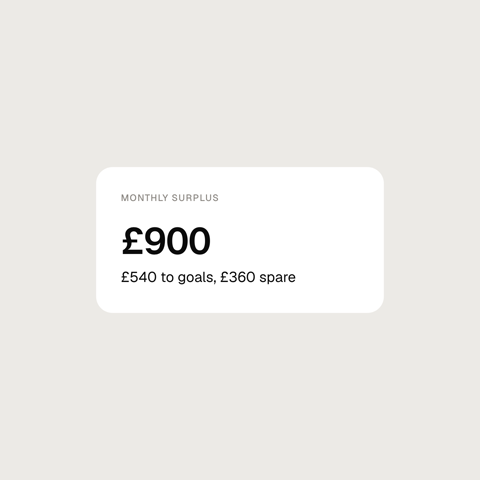

**Use when:** A headline number with a line of context: a monthly surplus, a balance, a score.

**Motion:** Title, figure and body rise in 0.08 beat apart. A following card row keeps what is unchanged and crossfades what changed (a new figure blurs out and back in) while the shape morphs to the new size.

| Prop | Type | Default |
|---|---|---|
| `title` | `string` | `"Monthly surplus"` |
| `figure` | `string` | `"£900"` |
| `body` | `string` | `"£540 to goals, £360 spare"` |

**Hotspots:** none  
**Sounds:** none

```js
{ at: 0, use: 'card', title: 'Monthly surplus', figure: '£900', body: '£540 to goals, £360 spare' }
```

### counter

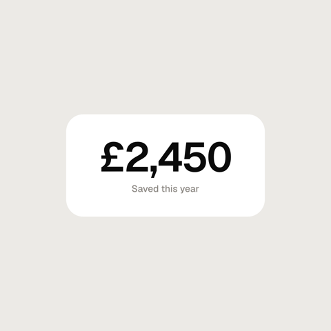

**Use when:** A number changes and the change is the story: a balance growing, a count going down.

**Motion:** The value rolls from `from` to `to` over about 1.2 beats (no overshoot), in tabular figures so the width never jitters. A following counter row rolls on from the previous row's `to` (its own `from` is ignored); a changed label crossfades.

| Prop | Type | Default |
|---|---|---|
| `from` | `number` | `0` |
| `to` | `number` | `2450` |
| `prefix` | `string` | `""` |
| `suffix` | `string` | `""` |
| `decimals` | `number` | `0` |
| `label` | `string` | `""` |

**Hotspots:** none  
**Sounds:** none

```js
{ at: 0, use: 'counter', from: 0, to: 2450, prefix: '£', label: 'Saved this year' }
```

### goal

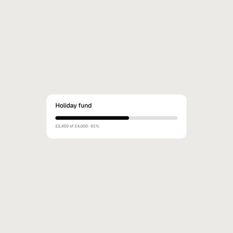

**Use when:** Progress towards a target amount: a savings pot, a fundraiser, a budget.

**Motion:** The bar fills to saved / target over about 1.2 beats (no overshoot) while the amount and percentage count with it. Once met (`met`, or saved reaches the target) the bar turns `pos` (accent when the theme has none) and a check chip pops. A following goal row fills on from the previous amount (a changed target eases with it; from or to a zero target it changes at once); a changed label crossfades.

| Prop | Type | Default |
|---|---|---|
| `label` | `string` | `"Holiday fund"` |
| `saved` | `number` | `2450` |
| `target` | `number` | `4000` |
| `prefix` | `string` | `"£"` |
| `met` | `boolean` | `false` |

**Hotspots:** `bar`  
**Sounds:** none

```js
{ at: 0, use: 'goal', label: 'Holiday fund', saved: 2450, target: 4000 }
```

### line-chart

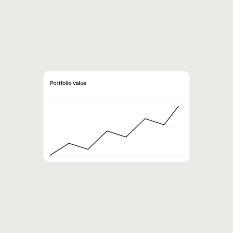

**Use when:** A value over time: a portfolio, a balance, a weekly total.

**Motion:** The line draws on from left to right over about 1.5 beats. With `hover` set (a point index), a dot pops on that point and a tooltip shows its value 1.6 beats in. The cursor hovers too: a cursor row aimed at `point:<i>` pops the dot and tooltip of that point from its beat, and they fade out when a later cursor row aims elsewhere, including at another point (which pops in as the old one fades); a point still hovered when a following line-chart row starts stays hovered. A continuation that changes `hover` fades the old tooltip out first; a `hover` that takes over from a cursor hover fades in after it (leaving the point `hover` already shows keeps its tooltip up). A following line-chart row does not redraw: the line morphs point for point into the new points (resampled when the count changes) and its scale eases to the new range; a changed label crossfades.

| Prop | Type | Default |
|---|---|---|
| `points` | `number[]` | `[4,6,5,8,7,10,9,13]` |
| `label` | `string` | `"Portfolio value"` |
| `hover` | `number` | `-1` |
| `format` | `object` | `{"prefix":"","decimals":0}` |

**Hotspots:** `point:<i>`  
**Sounds:** none

```js
{ at: 0, use: 'line-chart', label: 'Portfolio value', points: [4, 6, 5, 8, 7, 10, 9, 13] }
```

### list

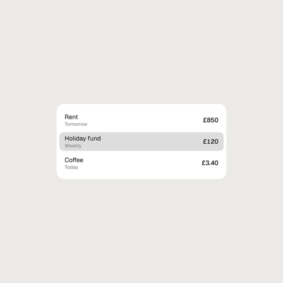

**Use when:** A short list of items with amounts: upcoming bills, recent transactions, goals.

**Motion:** Rows rise in one after another (0.06 beat apart). `highlight` (a row index) or a press on `row:<i>` gives that row a soft accent background; a following list row continues from the pressed row (write it as its `highlight`). A following row keeps rows that are unchanged, crossfades changed ones, and the shape grows or shrinks for added or removed rows. At most 8 rows show.

| Prop | Type | Default |
|---|---|---|
| `rows` | `object[]` | `[{"title":"Rent","detail":"Tomorrow","value":"£850"},{"title":"Holiday fund","detail":"Weekly","value":"£120"},{"title":"Coffee","detail":"Today","value":"£3.40"}]` |
| `highlight` | `number` | `-1` |

**Hotspots:** `row:<i>`  
**Sounds:** none

```js
{ at: 0, use: 'list', highlight: 1 }
```

### sparkline

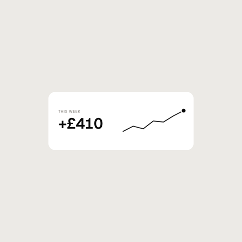

**Use when:** A figure with its recent trend: this week's spend, a streak, a balance.

**Motion:** The label and figure rise in, the line draws on over about a beat, then the last point's dot pops (a small overshoot). A following sparkline row morphs the line point for point into the new points, the dot riding the last point; a changed label or figure crossfades.

| Prop | Type | Default |
|---|---|---|
| `points` | `number[]` | `[3,4,3.5,5,4.8,6,7]` |
| `label` | `string` | `"This week"` |
| `value` | `string` | `"+£410"` |

**Hotspots:** `last`  
**Sounds:** none

```js
{ at: 0, use: 'sparkline', label: 'This week', value: '+£410', points: [3, 4, 3.5, 5, 4.8, 6, 7] }
```

## App chrome

[avatar-stack](#avatar-stack) · [banner](#banner) · [chip-row](#chip-row) · [command](#command) · [dock](#dock) · [island](#island) · [player](#player) · [sheet](#sheet)

### avatar-stack

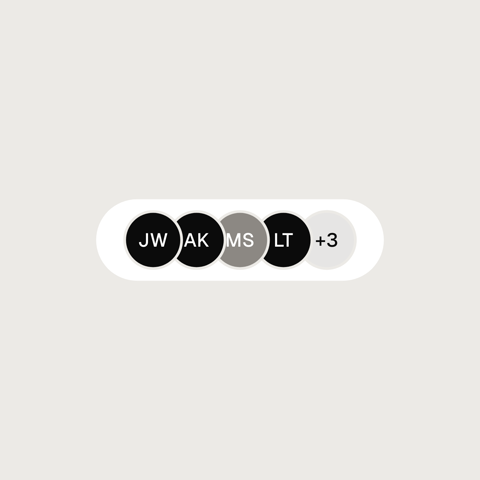

**Use when:** A few people share something: a goal, a document, a household budget.

**Motion:** The avatars pop in left to right (0.06 beat apart), then the +n chip. While a cursor row is aimed at `avatar:<i>` that avatar lifts 10px and the others spread 8px away from it (no overshoot); aiming elsewhere settles them back. The hover carries into a following avatar-stack row, which pops in only avatars whose initials changed. At most 16 avatars show.

| Prop | Type | Default |
|---|---|---|
| `people` | `string[]` | `["JW","AK","MS","LT"]` |
| `extra` | `number` | `3` |

**Hotspots:** `avatar:<i>`  
**Sounds:** none

```js
{ at: 0, use: 'avatar-stack', people: ['JW', 'AK', 'MS', 'LT'], extra: 3 }
```

### banner

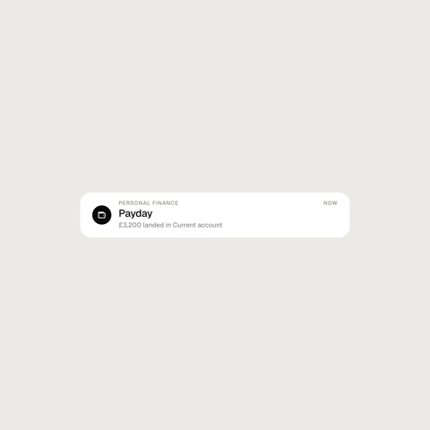

**Use when:** Something arrives from outside the app: payday, a reminder, a shared goal, a sign-in.

**Motion:** The content slides down 16px and unblurs as it fades in after the shape arrives (icon first, then the text). A press on the banner dips it. A following banner row slides changed content in the same way while the old content fades out.

| Prop | Type | Default |
|---|---|---|
| `app` | `string` | `"Personal Finance"` |
| `title` | `string` | `"Payday"` |
| `body` | `string` | `"£3,200 landed in Current account"` |
| `icon` | `enum:bell\|wallet\|info\|sparkle` | `"bell"` |

**Hotspots:** `banner`  
**Sounds:** none

```js
{ at: 0, use: 'banner', title: 'Payday', body: '£3,200 landed in Current account', icon: 'wallet' }
```

### chip-row

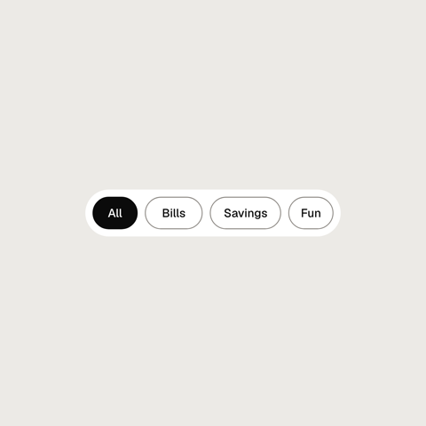

**Use when:** A list is filtered by category: all, bills, savings, fun.

**Motion:** A press on a chip selects it: single-select moves the selection there, `multi` toggles the pressed chip. Selected chips fill with the accent and their text turns surface with a quick colour spring; the pressed chip dips with the cursor. A following chip-row row continues from the selection after the presses (write it as its `selected`) and blends to its own `selected` on arrival if it differs.

| Prop | Type | Default |
|---|---|---|
| `chips` | `string[]` | `["All","Bills","Savings","Fun"]` |
| `selected` | `string[]` | `["All"]` |
| `multi` | `boolean` | `false` |

**Hotspots:** `chip:<label>`  
**Sounds:** none

```js
{ at: 0, use: 'chip-row', chips: ['All', 'Bills', 'Savings', 'Fun'], selected: ['All'] }
```

### command

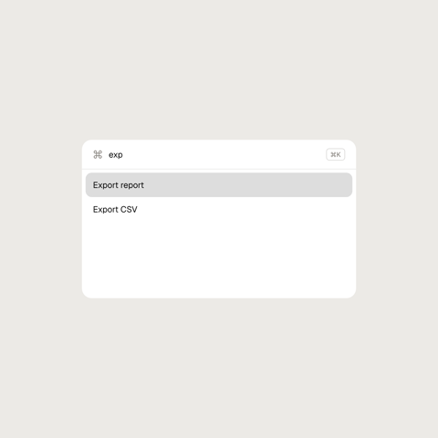

**Use when:** An app is driven from the keyboard: jump to a page, run an action, find a setting.

**Motion:** The query types in one character every perChar beats from typeAt (beats after the row starts; -1 shows it at once), with a key sound each, like input. The rows filter live (case-insensitive): rows that stop matching collapse and the rest slide up; rows that match again reopen, and when nothing matches a muted 'No results' line fades in. The selected row (an index among the visible rows) has a soft accent background that stays on that visible slot as the list filters; a press on `row:<i>` selects the i-th visible row. A following command row continues from the typed query (a query that extends it types on; any other query replaces it on arrival, the rows springing to the new filter) and the selected row (write it as its `selected`); with the same query a blinking caret keeps blinking. At most 5 items show. The palette keeps its full height while filtering; to shrink it, follow with a command row that sets `h` (96 + visible rows * 80 + 24).

| Prop | Type | Default |
|---|---|---|
| `items` | `string[]` | `["Export report","Export CSV","Invite teammate","New goal","Settings"]` |
| `query` | `string` | `""` |
| `typeAt` | `number` | `-1` |
| `perChar` | `number` | `0.25` |
| `selected` | `number` | `0` |

**Hotspots:** `field`, `row:<i>`  
**Sounds:** key

```js
{ at: 0, use: 'command', query: 'o', typeAt: 0.25 }
```

### dock

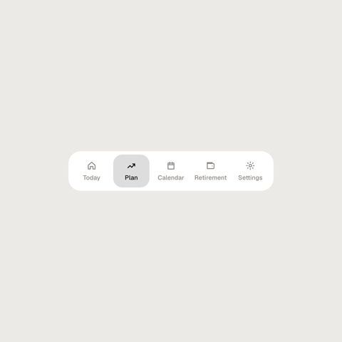

**Use when:** An app's main sections sit in a bottom bar: today, plan, calendar, settings.

**Motion:** A press on an item sends the pill there with two edges (settling in 0.22 s, no overshoot): the leading edge moves first, so the pill stretches and settles, and quick reversals stay inside the dock. The active item turns ink, the others muted. A following dock row continues from the last pressed item (write it as its `active`) and travels on arrival if `active` differs.

| Prop | Type | Default |
|---|---|---|
| `items` | `string[]` | `["Today","Plan","Calendar","Retirement","Settings"]` |
| `active` | `string` | `"Plan"` |
| `icons` | `string[]` | `["home","trend","calendar","wallet","settings"]` |

**Hotspots:** `item:<label>`  
**Sounds:** none

```js
{ at: 0, use: 'dock', active: 'Plan' }
```

### island

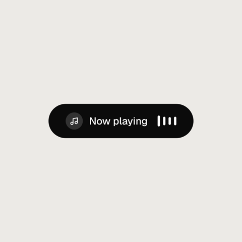

**Use when:** Something runs in the background and stays glanceable: music playing, a timer, a call.

**Motion:** Four waveform bars on the right bounce continuously, each at its own rate (about 0.5 to 0.8 s a bounce, trimmed so whole bounces fit the loop), off the clock, so they run on unbroken through a following island row. The content fades in after the shape arrives; a following island row crossfades a changed icon or text while the shape resizes.

| Prop | Type | Default |
|---|---|---|
| `text` | `string` | `"Now playing"` |
| `icon` | `enum:music\|timer\|none` | `"music"` |

**Hotspots:** `island`  
**Sounds:** none

```js
{ at: 0, use: 'island', text: 'Now playing' }
```

### player

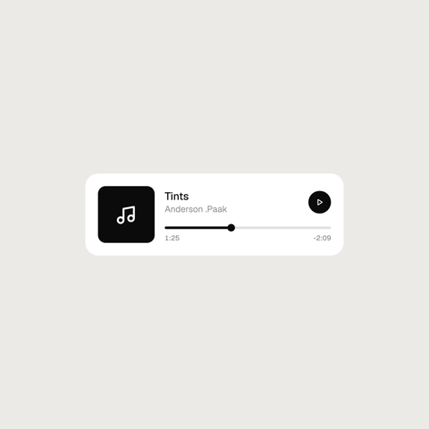

**Use when:** Media is playing or about to: a song, a podcast, a voice note.

**Motion:** A press on `play` swaps the play and pause icons (crossfade with a small scale) and starts or stops playback; while playing the position runs on with the clock (duration in seconds). Between a press 'down' on `thumb` and the next 'up' the thumb follows the cursor, and playback resumes from the release. A following player row carries on from where playback got to, unless it seeks: it seeks to its `position` on arrival (the thumb glides) only when that `position` differs from the one the previous player row wrote (a left-out `position` counts as the default), never because playback has moved on. To carry on, repeat the previous row's `position` or leave it out of both. It plays or pauses on arrival if `playing` differs and crossfades a changed title or artist. In a looping piece, start and end on a paused player; a playing one moves with the clock and cannot match at the seam.

| Prop | Type | Default |
|---|---|---|
| `title` | `string` | `"Midnight Drive"` |
| `artist` | `string` | `"The Placeholders"` |
| `playing` | `boolean` | `false` |
| `position` | `number` | `0.25` |
| `duration` | `number` | `214` |

**Hotspots:** `play`, `thumb`  
**Drag:** `thumb` (a drag is three cursor rows: down, move, up)  
**Sounds:** none

```js
{ at: 0, use: 'player', title: 'Midnight Drive', artist: 'The Placeholders', position: 0.4 }
```

### sheet

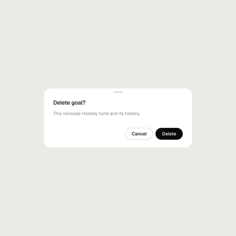

**Use when:** The app asks before doing something: delete, discard, sign out, confirm a payment.

**Motion:** The title, body and actions rise in one after another once the shape arrives. A press on an action dips it. A following sheet row crossfades changed content the same way.

| Prop | Type | Default |
|---|---|---|
| `title` | `string` | `"Delete goal?"` |
| `body` | `string` | `"This removes Holiday fund and its history."` |
| `actions` | `string[]` | `["Cancel","Delete"]` |
| `primary` | `string` | `"Delete"` |

**Hotspots:** `action:<label>`  
**Sounds:** none

```js
{ at: 0, use: 'sheet', title: 'Delete goal?', body: 'This removes Holiday fund and its history.' }
```
